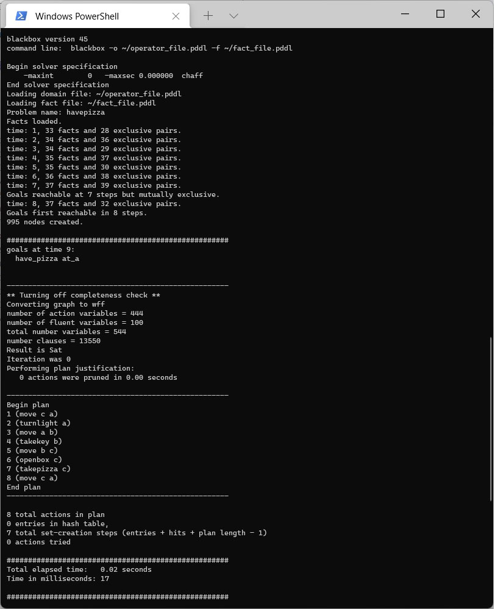

# bb-docker
Образ планировщика blackbox для Docker

## Сборка
``docker build --platform linux/i386 -t bb .``

## Запуск
Обязательно перейти в директорию с pddl

``cd lab1``

Запустить под Windows

``../bb.cmd -o operator_file.pddl -f fact_file.pddl``

Или запустить под macOS

``../bb.sh -o operator_file.pddl -f fact_file.pddl``

## Пример (outdated)

